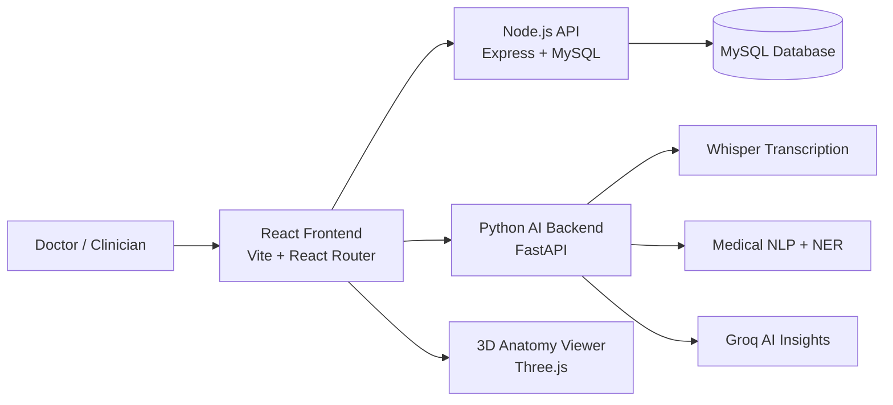

# Medical-Scribe

Medical-Scribe is a clinical documentation and patient-management platform focused on capturing doctor-patient consultations, transcribing audio, generating structured SOAP notes, and storing consultation records in a medical workflow.

The repository contains a full-stack implementation with a React frontend, a Node.js API for patient and consultation management, and a Python FastAPI AI backend for transcription, speaker-aware processing, and clinical note generation.

## Project Overview

This system is designed to help clinicians reduce manual documentation effort while keeping patient records organized. A doctor can log in, review patient information, start a consultation, record audio, and generate AI-assisted clinical notes that can be saved, edited, and revisited later.

The application also includes a 3D anatomy visualization layer and a patient history dashboard, making it easier to review prior consultations and connect recorded symptoms to body regions.

## Problem Statement

Clinical documentation is often done manually while the patient is speaking, which can lead to:

- incomplete or delayed notes
- inconsistent charting across consultations
- more time spent on data entry than patient care
- difficulty keeping a structured record of symptoms, diagnoses, and treatment plans

For many healthcare workflows, transcription and EHR-style note generation are still fragmented across separate systems.

## Solution

Medical-Scribe combines multiple parts of the workflow into a single system:

1. A doctor records or uploads a consultation.
2. The Python backend uses speech-processing and medical NLP logic to turn the audio or text into structured clinical output.
3. SOAP-style notes, extracted entities, and AI insights are generated.
4. The Node.js service stores patient and consultation data in MySQL.
5. The frontend presents the notes, patient history, and anatomy visualization for review.

The result is a practical documentation assistant for medical consultations, with patient records and structured notes tying directly into the app.

## Key Features

- doctor authentication and patient management
- consultation recording and transcript capture
- AI-powered transcription and medical text processing
- SOAP note generation for subjective, objective, assessment, and plan sections
- patient lookup and consultation history tracking
- MySQL-backed persistence for users, patients, and consultation records
- multilingual consultation language support for English, Hindi, Kannada, and Tamil
- 3D anatomy and body-visualization views
- clinical insight generation and medical entity extraction
- editable generated notes before saving

## Technology Stack

### Frontend
- React
- Vite
- React Router
- Tailwind CSS
- Framer Motion
- Three.js / React Three Fiber
- Lucide icons

### Backend
- Node.js
- Express
- MySQL via `mysql2`
- JWT-based auth
- CORS-enabled API server

### AI / ML
- Python
- FastAPI
- faster-whisper
- spaCy
- Hugging Face transformers
- Groq API integration
- PyTorch and sentencepiece dependencies

### Data / Storage
- MySQL
- encrypted patient/consultation field handling

### Development Tools
- ESLint
- dotenv
- npm
- Python virtual environments

## System Architecture



The frontend communicates with the Node API for authentication, patient records, and consultation persistence. AI transcription and note generation run through the Python backend, which returns structured clinical data back to the UI.

## Project Workflow

1. A doctor logs into the application.
2. A patient is selected or created.
3. Consultation audio is recorded or uploaded.
4. The Python backend transcribes audio and performs medical entity extraction.
5. SOAP notes and clinical insights are produced.
6. The frontend displays the transcript and generated note sections.
7. The record is saved through the Node API into MySQL.
8. The doctor can review patient history and anatomical context from the dashboard.

## Project Structure

```text
Medical-Scribe1/
├── README.md
├── INTEGRATION_GUIDE.md
├── ANALYSIS_AND_INTEGRATION_PLAN.md
├── anatomy_scan.json
├── api_e2e_check.ps1
├── check_regions.py
├── convert_anatomy.py
├── convert_anatomy_v2.py
├── convert_anatomy_v3.py
├── convert_anatomy_v4.py
├── convert_anatomy_v5.py
├── scan_anatomy.py
├── tiny_silence_test.ps1
├── backend/
│   ├── main.py
│   ├── nlp_pipeline.py
│   ├── insights_engine.py
│   ├── requirements.txt
│   ├── .env.example
│   ├── test_pipeline.py
│   └── ...
├── ai-medical-scribe/
│   ├── src/
│   ├── server/
│   ├── public/
│   ├── package.json
│   ├── package-lock.json
│   ├── .env.example
│   ├── vite.config.js
│   └── ...
└── .gitignore
```

Key areas:
- `backend/` contains the Python AI backend and medical NLP processing pipeline.
- `ai-medical-scribe/server/` contains the Express API, database configuration, and MySQL schema.
- `ai-medical-scribe/src/` contains the React application pages, components, and state management.
- `public/models/` stores human anatomy 3D assets used by the visualization pages.

## Installation and Setup

### Prerequisites

- Node.js 20+ recommended
- npm
- Python 3.10+
- MySQL Server
- A Groq API key for AI-based insights and speech processing

### 1. Clone the repository

```bash
git clone https://github.com/2005KAl/Medical-Scribe1.git
cd Medical-Scribe1
```

### 2. Set up the Python AI backend

```bash
cd backend
python -m venv .venv
# Windows
.venv\Scripts\activate
# macOS / Linux
# source .venv/bin/activate

pip install -r requirements.txt
copy .env.example .env
```

Update `.env` with the required Groq credentials and service configuration.

### 3. Set up the Node.js API

```bash
cd ../ai-medical-scribe/server
npm install
copy .env.example .env
```

Configure MySQL connection values, JWT secret, and encryption key in the server `.env` file.

### 4. Set up the frontend

```bash
cd ../
npm install
copy .env.example .env
```

Use the frontend `.env` file to point the React app to the correct Node and AI backend URLs.

## Environment Variables

### Frontend (`ai-medical-scribe/.env`)

```env
VITE_API_URL=http://localhost:5000/api
VITE_AI_API_URL=http://localhost:8000/api
VITE_BIODIGITAL_CLIENT_ID=
```

### Node API (`ai-medical-scribe/server/.env`)

```env
PORT=5000
NODE_ENV=development
DB_HOST=localhost
DB_USER=root
DB_PASSWORD=your_mysql_password
DB_NAME=medical_scribe_db
DB_PORT=3306
JWT_SECRET=your_super_secret_jwt_key_change_this_in_production
JWT_EXPIRE=30d
MEDICAL_DATA_ENCRYPTION_KEY=replace_with_long_random_value
CORS_ORIGIN=http://localhost:5173
```

### Python AI backend (`backend/.env`)

```env
GROQ_API_KEY=your_groq_api_key_here
WHISPER_MODEL=base
PORT=8000
HOST=127.0.0.1
JWT_SECRET=your_super_secret_jwt_key_change_this_in_production
CORS_ORIGINS=http://localhost:5173,http://localhost:5174,http://localhost:5000
LOG_LEVEL=INFO
```

## Running the Project

### Start MySQL

Make sure your local MySQL instance is running and create a database for the app.

### Start the Python AI backend

```bash
cd backend
# Activate your virtual environment if needed
python -m uvicorn main:app --host 127.0.0.1 --port 8000 --reload
```

### Start the Node.js API

```bash
cd ai-medical-scribe/server
npm start
```

### Start the frontend

```bash
cd ai-medical-scribe
npm run dev
```

The frontend is typically served at `http://localhost:5173`.

## Usage

1. Open the frontend in the browser.
2. Register or log in with a doctor account.
3. Navigate to the dashboard and select or create a patient.
4. Start a consultation and allow microphone access when prompted.
5. Speak the consultation or use text input.
6. Review the live transcript and generated clinical sections.
7. Save the finalized consultation to the database.
8. Use the patient records view and anatomy pages to review history and visual context.

## API Documentation

### Node.js API

| Method | Endpoint | Description |
| --- | --- | --- |
| POST | `/api/auth/login` | Authenticate a doctor account |
| POST | `/api/auth/register` | Register a new doctor account |
| GET | `/api/health` | Check server health |
| GET | `/api/patients` | List patient records for the logged-in doctor |
| GET | `/api/patients/:id` | Get patient details and consultation history |
| GET | `/api/patients/resolve` | Resolve a returning patient by ID, phone, or email |
| GET | `/api/consultations` | List consultations |
| POST | `/api/consultations` | Create a consultation record |
| PUT | `/api/consultations/:id` | Update a consultation |
| DELETE | `/api/consultations/:id` | Remove a consultation |
| POST | `/api/transcribe` | Send audio to Groq Whisper for transcription |

### Python AI API

| Method | Endpoint | Description |
| --- | --- | --- |
| GET | `/api/health` | Check AI backend health |
| POST | `/api/process-text` | Process clinical text and generate SOAP notes |
| POST | `/api/transcribe-and-generate` | Upload audio and get generated clinical output |
| WS | `/ws/{session_id}` | Stream live consultation audio/text processing |

## Database

The application uses MySQL as its relational data store. The schema is defined in `ai-medical-scribe/server/database/schema.sql`.

Key tables include:

- `users` — doctor accounts
- `patients` — patient demographic and contact record information
- `consultations` — visit transcript, SOAP notes, diagnosis, and follow-up information
- `prescriptions` — medication and treatment records associated with a consultation

The Node.js application also encrypts sensitive patient and consultation fields before storage.

## Notes

This project is a working prototype and integration-focused medical documentation app. It combines several modern web and AI tooling patterns, but its behavior depends on correct local configuration for MySQL and Groq credentials.

